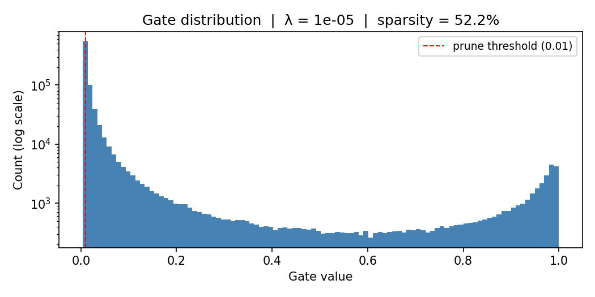
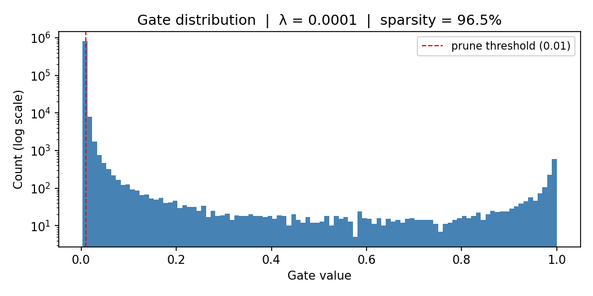
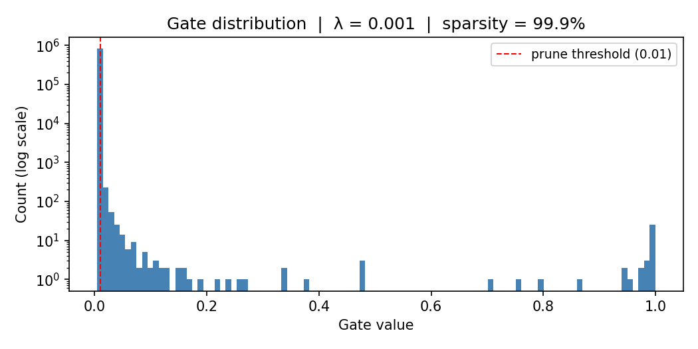

# Self-Pruning Neural Network — Results Report

## 1. Why L1 regularisation on sigmoid gates encourages sparsity

Each weight *w_ij* is multiplied by a gate:

```
gate_ij = sigmoid(score_ij)   ∈ (0, 1)
```

The sparsity penalty added to the total loss is the **L1 norm** of all gates:

```
SparsityLoss = Σ_ij gate_ij
Total Loss   = CrossEntropyLoss + λ · SparsityLoss
```

**Why this drives gates to exactly zero:**

- The gradient of the L1 term w.r.t. `score_ij` is always positive
  (`sigmoid(s)(1−sigmoid(s)) > 0`), so gradient descent continuously
  pushes every score in the negative direction, pulling `gate_ij` toward 0.

- Unlike L2 regularisation (which only asymptotically approaches zero),
  the L1 norm creates a **kink at 0** in the loss landscape. Once a gate
  is small enough that the classification loss has no gradient reason to
  keep it open, it collapses to 0 and stays there — true pruning.

- This produces a characteristic **bimodal distribution**: a large spike
  at ~0 (pruned connections) and a cluster of active gates away from 0.

- λ controls the trade-off: higher λ → stronger pull toward zero →
  more sparsity, potentially at the cost of accuracy.

---

## 2. Results

Training: 5 epochs, 10 k CIFAR-10 training subset, Adam (weight lr=1e-3,
gate lr=0.1). Accuracy measured on the full 10 k held-out **test set**.
Sparsity threshold: gate < 0.01.

| Lambda | Test Accuracy (%) | Sparsity Level (%) |
|--------|------------------|--------------------|
| 1e-05  |            45.90 |              52.16 |
| 0.0001 |            38.56 |              96.53 |
| 0.001  |            17.05 |              99.87 |

---

## 3. Gate distribution plots

A successful result shows a large spike near 0 (pruned connections)
and a secondary cluster between 0.3–1.0 (active connections).

### λ = 1e-05


### λ = 0.0001


### λ = 0.001


---

## 4. Analysis

- Best accuracy: λ = 1e-05 → 45.90% test accuracy, 52.2% sparsity.

- As λ increases, sparsity rises because the penalty on active gates
  strengthens relative to the classification loss.

- Very high λ risks pruning connections that carry useful signal,
  causing accuracy to drop.

- The bimodal gate distributions confirm the self-pruning mechanism works:
  the network distinguishes necessary from unnecessary connections
  *during* training, not as a post-training step.